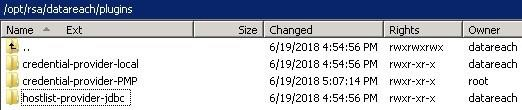

>  style="width:2.83333in;height:1.07292in" />

RSA DataReach

> Installation and Configuration Guide

Version 1.5.08 ● July 13, 2019

> **Contents**

1.  [Installation Scenarios 4](#installation-scenarios)

2.  [Installation Pre-Requisites 4](#installation-pre-requisites)

    1.  [Operating System Requirements
        4](#operating-system-requirements)

    <!-- -->

    2.  [Hardware Requirements 4](#hardware-requirements)

    <!-- -->

    3.  [Database Requirements 5](#database-requirements)

    4.  [Port Requirements 5](#port-requirements)

3.  [Master Controller Installation Steps
    5](#master-controller-installation-steps)

4.  [Agent Installation Steps 6](#agent-installation-steps)

5.  [Database Installation Steps 8](#database-installation-steps)

6.  [Master Controller Configuration
    9](#master-controller-configuration)

    1.  [Primary Master Controller Configuration File - setenv.sh
        9](#primary-master-controller-configuration-file---setenv.sh)

    2.  [Installing Provider Plugins 10](#installing-provider-plugins)

    3.  [Plugin Configuration – config.xml
        11](#plugin-configuration-config.xml)

7.  [Agent Server Configuration 14](#agent-server-configuration)

    1.  [Agent Configuration File – setenv.sh
        14](#agent-configuration-file-setenv.sh)

    2.  [Primary Agent Configuration File – agentcontroller.xml
        15](#primary-agent-configuration-file-agentcontroller.xml)

    3.  [Agent Log Configuration– log4j2.xml
        15](#agent-log-configuration-log4j2.xml)

8.  [Agent Configuration 16](#agent-configuration)

    1.  [Agent Configuration - agent_configuration.xml
        16](#agent-configuration---agent_configuration.xml)

    2.  [package/config/package.xml 17](#packageconfigpackage.xml)

9.  [Schema Information 18](#schema-information)

    1.  [Local Host List Provider 18](#local-host-list-provider)

        1.  [Specifying a JDBC driver 18](#specifying-a-jdbc-driver)

        2.  [Expected Columns 18](#expected-columns)

        3.  [Host Metadata 18](#host-metadata)

    2.  [Local Credential Provider 19](#local-credential-provider)

10. [Certificate Requirements and Management
    19](#certificate-requirements-and-management)

    1.  [Master Controller Certificate Requirements
        19](#master-controller-certificate-requirements)

    2.  [Agent Certificate Requirements
        19](#agent-certificate-requirements)

    3.  [Putting your issued certificates to use
        20](#putting-your-issued-certificates-to-use)

11. [Running DataReach 20](#running-datareach)

    1.  [Master Controller Service 20](#master-controller-service)

    2.  [Agent 21](#agent)

12. [DataReach Utilities 22](#datareach-utilities)

    1.  [*help* 22](#help)

    2.  [*envpath* 24](#envpath)

        1.  [*generate* 24](#generate)

    3.  [*encrypt* 24](#encrypt)

        1.  [*csv* 24](#csv)

        2.  [*string* 25](#string)

13. [Troubleshooting 25](#troubleshooting)

    1.  [Master Controller 25](#master-controller)

    2.  [Agent 27](#agent-1)

# Installation Scenarios

> The RSA DataReach solution has three (3) core components that need to
> be installed. The exact location and prerequisites for these
> components depends upon your requirements:
>
> **Master Controller** – This component is responsible for serving as a
> central configuration point- hosting all agent configurations, and
> piping data to the Oracle database for collection.
>
> **Agent** – This component is responsible for collecting endpoint
> data.
>
> **Database** – The database will store all the data and metadata
> collected by the solution. All the pruning and data validation stored
> procedures are contained in this database.

<table>
<colgroup>
<col style="width: 23%" />
<col style="width: 76%" />
</colgroup>
<thead>
<tr>
<th><strong>Scenario</strong></th>
<th><blockquote>

<strong>Description</strong>

</blockquote></th>
</tr>
</thead>
<tbody>
<tr>
<td><strong>Single Server</strong></td>
<td><blockquote>

In this scenario, all 3 components are installed directly on your IGL
application server.

</blockquote></td>
</tr>
<tr>
<td><strong>Agent, Local Database</strong></td>
<td><blockquote>

In this scenario, the master controller and the database are
installed on the IGL application server, while agents are deployed
throughout your environment.

</blockquote></td>
</tr>
<tr>
<td><strong>Agent, Dedicated Database</strong></td>
<td><blockquote>

In this scenario, agents are deployed throughout your environment.
The dedicated Oracle database instance separate from IGL has to be
provided by the organization. In this deployment, the master controller
can be installed on any of the systems.

</blockquote></td>
</tr>
</tbody>
</table>

# Installation Pre-Requisites

## Operating System Requirements

- **Master Controller** - A virtual or physical **Linux** (Any)
  operating system based host system owned and managed by the
  organization. Based on the deployment scenario chosen, this can also
  be the IGL server.

- **Agent** - A virtual or physical **Linux** (Any) or **Windows** (Any)
  operating system based host system owned and managed by the
  organization. Based on the deployment scenario chosen, this can also
  be the RSA IGL server.

## Hardware Requirements

<table>
<colgroup>
<col style="width: 6%" />
<col style="width: 17%" />
<col style="width: 75%" />
</colgroup>
<thead>
<tr>
<th><strong>RAM</strong></th>
<th><blockquote>

<strong>Database</strong>

<strong>Master Controller Agent</strong>

</blockquote></th>
<th><blockquote>

Minimum 32 GB

4 GB dedicated memory allocation 2 GB dedicated memory
allocation.

</blockquote>
<ul>
<li>
If agents are to be run in parallel then the RAM needs to be a
factor of number of agents.
</li>
<li>
This memory allocation needs to be revised if the agents are
collecting large volumes of data.
</li>
</ul></th>
</tr>
</thead>
<tbody>
<tr>
<td><strong>CPU</strong></td>
<td><blockquote>

<strong>Database</strong>

<strong>Master Controller Agent</strong>

</blockquote></td>
<td><blockquote>

Minimum 2 quad-core CPUs Dual core processor

Dual core processor

</blockquote></td>
</tr>
<tr>
<td><strong>Disk</strong></td>
<td><blockquote>

<strong>Database</strong>

<strong>Master Controller Agent</strong>

</blockquote></td>
<td><blockquote>

Minimum 500 GB

1 GB

200 MB per agent

</blockquote></td>
</tr>
</tbody>
</table>

> ***Note: It is recommended that the Oracle database used for RSA IGL
> be used for DataReach.***

## Database Requirements

> DataReach requires an **Oracle 11g or above** database for staging the
> collected data. This can be a standalone Oracle database or the
> database used by RSA IGL.

## Port Requirements

> DataReach by default uses the following ports:

<table>
<colgroup>
<col style="width: 9%" />
<col style="width: 15%" />
<col style="width: 75%" />
</colgroup>
<thead>
<tr>
<th><strong>21</strong></th>
<th><blockquote>

<strong>FTP</strong>

</blockquote></th>
<th><blockquote>

This port is used for FTP connections.

</blockquote></th>
</tr>
</thead>
<tbody>
<tr>
<td><strong>22</strong></td>
<td><blockquote>

<strong>SSH</strong>

</blockquote></td>
<td><blockquote>

This port is used for SSH connections

</blockquote></td>
</tr>
<tr>
<td><strong>10443</strong></td>
<td><blockquote>

<strong>HTTPS</strong>

</blockquote></td>
<td><blockquote>

This configurable port is used by agents to connect to the Master
Controller.

</blockquote></td>
</tr>
</tbody>
</table>

# Master Controller Installation Steps

> The Master Controller zip archive file is intended to be fully
> self-contained. Included in the Master Controller zip archive are the
> following components:

- A self-contained Oracle Java 11 JRE (11.0.2)

- A pre-configured Apache Tomcat web server (9.0.17)

- Sample SSL certificate and key store

- A sample agent configuration

- Necessary scripts for launching the Master Controller process

#### Steps

1.  Obtain the latest MasterController\_\<version\>.zip file from RSA
    professional services.

2.  Using WinSCP or similar SCP client, copy the zip file to the
    applicable IGL appliance. Place the file in the /opt/rsa folder. The
    subsequent steps in this document assume this location is used.

3.  Extract the archive.

> tar -xf /opt/rsa/MasterController\_\<Version\>.tar.gz /opt/rsa

4.  Set ownership recursively to the directory. In the example below
    datareach is the user who will own the directory and users is the
    corresponding user group.

> chown -R datareach:users /opt/rsa/datareach

5.  Set executable permission on setperms.sh.

> chmod +x /opt/rsa/datareach/mastercontroller/scripts/setperms.sh

6.  Run the setperms.sh script to set the proper filesystem permissions.

> /opt/rsa/datareach/mastercontroller/scripts/setperms.sh

7.  When ready, see section Master Controller Service for instructions
    on how to install the Master Controller as a service on your server.
    This typically occurs after initial configuration as outlined in
    section Master Controller Configuration.

> ***Note: The DataReach installation path is configurable. For
> simplicity, this documentation will refer to this path as /opt/rsa
> path throughout the document. The settings will have to be modified
> accordingly if an alternate location is chosen for installation.***

# Agent Installation Steps

> The base Agent archive file is intended to be fully self-contained
> package for both Windows and Linux operating systems. Included in the
> base Agent archive are the following components:

- A self-contained Oracle Java runtime (11.0.2)

- Sample configuration (to be modified to match the your environment)

- Sample SSL certificate and key store

- Necessary scripts for launching the Agent process

> Once the base agent has been extracted, additional job package must be
> installed. The following job packages are available based on your
> licensing:

- **Database Collection Job** (Agent_Job_Database\_\<version\>.tar.gz)

- **UNIX Collection Job** (Agent_Job_UNIX\_\<version\>.tar.gz)

- **Windows Collection Job** (Agent_Job_Windows\_\<version\>.tar.gz)

##### *Note: A single job package must be installed on a given agent.*

While choosing an agent name, the following caveats apply.

▪

▪

▪

The agent name must be eight (8) characters or shorter.

The agent name must be made up of alphanumeric characters or the
following special characters \$, \_, and \#.

The agent name should not contain reserved Oracle words. (See SELECT \*
FROM v\$reserved_words where reserved = 'Y' for list of reserved words)

#### Steps

1.  Obtain the latest Agent\_\<os\>\_\<version\>.zip file from RSA
    professional services. Here the OS can have the values ***Windows***

> or ***Linux***.

2.  For Windows, the Agent_Windows\_\<version\>.zip file has to be
    copied to the target Windows Server 2008 or higher system and has to
    be extracted. This completes the initial installation step for
    Windows based agent.

3.  For Linux, using WinSCP or another SCP client, copy the zip file to
    the applicable Linux server. Place the file in the /opt/rsa folder.
    The subsequent steps in this document assume this location is used.

4.  Extract the base agent archive file.

> tar -zxf /opt/rsa/Agent\_\<os\>\_\<version\>.tar.gz -C
> /opt/rsa/datareach/\<agent_name\>

5.  Depending on the role of the agent, extract the job package file.
    These job packages are OS independent.

> tar -zxf /opt/rsa/ Agent_Job_Database\_\<version\>.tar.gz -C
> /opt/rsa/datareach/\<agent_name\>

6.  Set ownership recursively to the directory. In the example below
    datareach is the user who will own the directory and users is the
    corresponding user group.

> chown -R datareach:users /opt/rsa/datareach/\<agent_name\>

5.  Set executable permission on setperms.sh.

> chmod +x /opt/rsa/datareach/\<agent_name\>/scripts/setperms.sh

6.  Run the setperms.sh script to set the proper filesystem permissions.

> /opt/rsa/datareach/\<agent_name\>/scripts/setperms.sh

7.  After configuration, as defined in section Agent Server
    Configuration, schedule the executable to run on a schedule as
    desired.

> ***Note: The DataReach installation path is configurable. For
> simplicity, this documentation will refer to this path as /opt/rsa
> path throughout the document. The settings will have to be modified
> accordingly if an alternate location is chosen for installation.***

# Database Installation Steps

> A database installation script is provided with DataReach that
> performs the following steps on the target database.

- Creates a dedicated tablespace for the DataReach solution.

- Creates a dedicated user/schema for DataReach. An initial quota is set
  to 10GB to protect the database against rampant data growth.

- Creates all necessary tables, and grants the proper permissions to the
  DataReach user.

- Installs and compiles the DataReach package, containing the necessary
  stored procedures.

#### Steps

1.  Obtain the 000_DataReach_Database.sql file from RSA professional
    services.

2.  Login to the target database as SYSDBA (a DBA from your organization
    may be required to do this on your behalf).

3.  Execute the given SQL script on the database.

4.  Reset the RSA_DATAREACH user password as desired.

# Master Controller Configuration

> This section defines the steps required to configure the Master
> Controller service. With this configuration, a fully functional Master
> Controller can be stood up.
>
> It should be noted these steps are all very specific to the Master
> Controller service itself, and does not define any of the settings for
> how data calculated or served up to agents. That is covered in section
> Agent Configuration.
>
> At a high level, the Master Controller configuration has to be
> performed in the following order.

<table>
<colgroup>
<col style="width: 5%" />
<col style="width: 94%" />
</colgroup>
<thead>
<tr>
<th>1</th>
<th><blockquote>

Run the DataReach Utilities to generate a unique DR_ENV_PATH value.
Refer to DataReach Utilities - envpath for more information on running
this utility.

</blockquote></th>
</tr>
</thead>
<tbody>
</tbody>
</table>

<table>
<colgroup>
<col style="width: 5%" />
<col style="width: 94%" />
</colgroup>
<thead>
<tr>
<th>2</th>
<th><blockquote>

Generate the SSL certificate for Master Controller and copy the JKS
keystore to the certificates directory. The default location is
/opt/rsa/datareach/mastercontroller/certificates. Refer to Certificate
Requirements and Management section for more information about
certificate requirements.

</blockquote></th>
</tr>
</thead>
<tbody>
</tbody>
</table>

<table>
<colgroup>
<col style="width: 5%" />
<col style="width: 94%" />
</colgroup>
<thead>
<tr>
<th>3</th>
<th><blockquote>

Configure setenv.sh. Refer to Primary Master Controller Configuration
File - setenv.sh section for more information.

</blockquote></th>
</tr>
</thead>
<tbody>
</tbody>
</table>

<table>
<colgroup>
<col style="width: 5%" />
<col style="width: 94%" />
</colgroup>
<thead>
<tr>
<th>4</th>
<th><blockquote>

Install host list provider and/or credentials provider plugins if not
using the default plugins. Refer to Installing Provider Plugins for more
information.

</blockquote></th>
</tr>
</thead>
<tbody>
</tbody>
</table>

<table>
<colgroup>
<col style="width: 5%" />
<col style="width: 94%" />
</colgroup>
<thead>
<tr>
<th>5</th>
<th><blockquote>

Configure host list provider and credentials provider plugins. Refer
to Plugin Configuration – config.xml for more

information.

</blockquote></th>
</tr>
</thead>
<tbody>
</tbody>
</table>

<table>
<colgroup>
<col style="width: 5%" />
<col style="width: 94%" />
</colgroup>
<thead>
<tr>
<th>6</th>
<th><blockquote>

Add agent configurations and supporting files as explained in the
Agent Configuration section. If Local Host List Provider and/or Local
Credential Provider are being used, refer to the Schema Information
section for creating the repositories.

</blockquote></th>
</tr>
</thead>
<tbody>
</tbody>
</table>

## Primary Master Controller Configuration File - setenv.sh

> This file specifies all the necessary environment variables for
> configuring the MasterController’s built in web application server,
> Tomcat.
>
> By default, the path of this file is
> /opt/rsa/datareach/mastercontroller/tomcat/tomcat-datareach/bin/setenv.sh.
>
> **Note**: Only the variables mentioned below can be modified. Any
> other settings in this file shall not be modified without the
> involvement of RSA professional services.

<table>
<colgroup>
<col style="width: 26%" />
<col style="width: 73%" />
</colgroup>
<thead>
<tr>
<th><strong>Parameter Name</strong></th>
<th><blockquote>

<strong>Description</strong>

</blockquote></th>
</tr>
</thead>
<tbody>
<tr>
<td><strong>DATAREACH_CWD</strong></td>
<td><blockquote>

This environment variable is set by the

/opt/rsa/datareach/mastercontroller/scripts/datareach/datareach_startup.sh
script, and sets the root of the Master Controller installation.

</blockquote></td>
</tr>
</tbody>
</table>

<table>
<colgroup>
<col style="width: 38%" />
<col style="width: 61%" />
</colgroup>
<thead>
<tr>
<th><strong>DR_AGENT_CONFIG_DIR</strong></th>
<th>
Sets the agent configuration root directory. By default, this
value will be

/opt/rsa/datareach/mastercontroller/agent_configs. Within this
folder, there will be a folder for each agent present. For example, if
there is an agent named ra1, there will need to be a folder on the
Master Controller named

/opt/rsa/datareach/mastercontroller/agent_configs/ra1. This parameter
should not be modified unless required.
</th>
</tr>
</thead>
<tbody>
<tr>
<td><strong>DR_MASTER_CONTROLLER_KEYSTORE</strong></td>
<td>The path to the Java keystore that the Master Controller uses to
host a TLS1.2 web service. Refer to section Master Controller
Certificate Requirements for instructions on how to obtain this
file.</td>
</tr>
<tr>
<td><strong>DR_MASTER_CONTROLLER_KEYSTORE_PASSWORD</strong></td>
<td>The password to the key store mentioned above. This value can be
encrypted using the string encryption option provided by the DataReach
Utilities.</td>
</tr>
<tr>
<td><strong>DR_MASTER_CONTROLLER_KEY_ALIAS</strong></td>
<td>The alias that the Master Controller’s certificate is known as
within the keystore. This is used in the event that there are multiple
SSL certificates/keys specified within the keystore.</td>
</tr>
<tr>
<td><strong>DR_MASTER_CONTROLLER_TRUSTSTORE</strong></td>
<td>The Java trust store that the Master Controller will use when
performing mutual-SSL authentication with the Agents.</td>
</tr>
<tr>
<td><strong>DR_MASTER_CONTROLLER_TRUSTSTORE_PASSWORD</strong></td>
<td>The password for the trust store mentioned above. This value can be
encrypted using the string encryption option provided by the DataReach
Utilities.</td>
</tr>
<tr>
<td><strong>DR_ENV_PATH</strong></td>
<td>This parameter is used by the encryption subsystem to protect local
configuration resources. It must be set uniquely for each environment.
This parameter must be set for every Master Controller instance based on
the value generated by generate utility.</td>
</tr>
<tr>
<td><strong>DR_PLUGINS_DIR</strong></td>
<td>
Sets the plugins root directory. By default, this value will
be

/opt/rsa/datareach/mastercontroller/plugins. This folder contains all
the installed credential providers and host list providers. This
parameter should not be modified unless required.
</td>
</tr>
<tr>
<td><strong>DR_LOG4J2_CONFIG_FILE</strong></td>
<td>
Sets the location of the Log4j2 configuration file used by the
Master Controller for logging. By default, this value will be

/opt/rsa/datareach/mastercontroller/scripts/log4j2.xml. For most
deployments, it is recommended that this value remains
unmodified.
</td>
</tr>
<tr>
<td><strong>DR_LOGS_DIR</strong></td>
<td>
Sets the logs directory. By default, this value will be

/opt/rsa/datareach/mastercontroller/logs. This folder contains all
the DataReach log files. Tomcat logs are available under

/opt/rsa/datareach/mastercontroller/tomcat/tomcat-datareach/logs.
</td>
</tr>
</tbody>
</table>

## Installing Provider Plugins

> DataReach has plugins to provide support for acquiring credentials,
> host lists and error handling for use with collections process. By
> default, DataReach comes with a local credentials provider plugin and
> host list provider plugins.
>
> If additional integrations are required, the plugins must be acquired
> from RSA Professional Services and be installed. The plugins can be
> hot deployed and requires no server restarts. The following example
> shows an additional plugin installed, a credential provider for Manage
> Engine Password Manager Pro
>
>  style="width:5.46067in;height:1.14583in" />
>
> Once plugin has been installed and configured, the plugin can be used
> by updating the Agent Configuration - agent_configuration.xml
>
> DataReach suite includes the following premium plugins. Contact your
> RSA representative for detail on these premium provider plugins.

#### Host List Providers

- ServiceNow

#### Credential Providers

- HashiCorp Vault

- Thycotic Secret Server

- ManageEngine Password Manager Pro

#### Error Handlers

- ServiceNow

- Zendesk Support

- Jira Service Desk

## Plugin Configuration – config.xml

> Plugins have to be configured post installation so that they can be
> used within the agent_configuration.xml. For every installed plugin,
> the config.xml can be found under
> /opt/rsa/datareach/mastercontroller/plugins/\<PLUGIN_NAME\>
> **Credential Provider Plugins**
>
> The config.xml contains configurations specific to the implementation
> of the credential provider. The section below explains the
> configurations for the default credentials provider. The values within
> this XML can be encrypted using the string encryption option provided
> by the DataReach Utilities. **Local Credentials Provider**

<table>
<colgroup>
<col style="width: 100%" />
</colgroup>
<thead>
<tr>
<th><blockquote>

<strong>Sample Configuration File</strong>

</blockquote></th>
</tr>
</thead>
<tbody>
<tr>
<td><blockquote>

&lt;?xml version=<em>"1.0"</em> encoding=<em>"ISO-8859-1"</em>
?&gt;

&lt;configuration&gt;

&lt;url&gt;jdbc:csv:////opt/rsa/datareach/mastercontroller/agent_configs/oracle/private?_CSV_Header=tr
ue&lt;/url&gt;

&lt;query&gt;select credential_alias, user_name, password from
credentials&lt;/query&gt;

&lt;/configuration&gt;

</blockquote></td>
</tr>
</tbody>
</table>

#### url

> Specifies the URL to connect to the target CSV file in the structure
> defined by the HXTT JDBC driver.

#### query

> Specifies the SQL query to retrieve the host list information from the
> database.

#### Host List Provider Plugins

> The config.xml contains configurations specific to the implementation
> of the host list provider. The section below explains the
> configurations for the default credentials provider. The values within
> this XML can be encrypted using the string encryption option provided
> by the DataReach Utilities.

#### JDBC Host List Provider

<table>
<colgroup>
<col style="width: 100%" />
</colgroup>
<thead>
<tr>
<th><blockquote>

<strong>Sample Configuration File</strong>

</blockquote></th>
</tr>
</thead>
<tbody>
<tr>
<td><blockquote>

&lt;?xml version=<em>"1.0"</em> encoding=<em>"ISO-8859-1"</em>
?&gt;

&lt;configuration&gt;

&lt;driver_class&gt;com.hxtt.sql.text.TextDriver&lt;/driver_class&gt;

&lt;url&gt;jdbc:csv:////opt/rsa/datareach/mastercontroller/agent_configs/dummy?_CSV_Header=true&lt;/url&gt;

&lt;query&gt;select host_type, alias_type, host_name,
connection_string, credential_alias, connection_string as cust_attr_1,
platform as cust_attr_2 from hosts left outer join platforms on
host_name like ('%' + db_pattern + '%')&lt;/query&gt;

&lt;username&gt;&lt;/username&gt;

&lt;password&gt;&lt;/password&gt;

&lt;!--

Optional

Add any agent specific configuration below. These take precedence
over the ones defined in the general section above. The node name under
agents MUST match the agent name defined.

Valid Nodes : <u>&lt;driver_class&gt;</u>, <u>&lt;url&gt;</u>,
&lt;query&gt;, <u>&lt;username&gt;</u>, &lt;password&gt;

--&gt;

&lt;agents&gt;

&lt;oracle&gt;

&lt;url&gt;jdbc:csv:////opt/rsa/datareach/mastercontroller/agent_configs/oracle?_CSV_Header=true&lt;/url&gt;

&lt;/oracle&gt;

&lt;mssql&gt;

&lt;url&gt;jdbc:csv:////opt/rsa/datareach/mastercontroller/agent_configs/<u>mssql</u>?_CSV_Header=true&lt;/url&gt;

&lt;/mssql&gt;

&lt;/agents&gt;

&lt;/configuration&gt;

</blockquote></td>
</tr>
</tbody>
</table>

> **driver_class**
>
> Specifies the fully qualified class name of the JDBC driver provided
> by the database vendor. By default, HXTT driver is provided to collect
> host information from CSV file.

#### url

> Specifies the URL to connect to the target database in the structure
> defined in the JDBC driver’s product documentation.

#### query

> Specifies the SQL query to retrieve the host list information from the
> database.

#### username

> Specifies the username if required to authenticate with the target
> database.

#### password

> Specifies the password corresponding to the user name provided above.

#### agents

> The above attributes are applicable to all the agents. If specific
> configuration has to be overridden, an agent specific configuration
> can be added under this node. Example if ***query*** for an agent by
> the name “***oracle***” has to be overridden, the following
> configuration needs to be added.
>
> \<agents\>
>
> \<oracle\>
>
> \<query\>select host_type, alias_type, host_name, connection_string,
> credential_alias from hosts where dbtype=’oracle’\</url\>
>
> \</oracle\>
>
> \</agents\>

# Agent Server Configuration

> This section defines the steps necessary to configure an agent. Since
> the agent receives the bulk of its configuration from the Master
> Controller at runtime, few configuration options are available.
>
> At a high level, the Agent configuration has to be performed in the
> following order.

<table>
<colgroup>
<col style="width: 5%" />
<col style="width: 94%" />
</colgroup>
<thead>
<tr>
<th>1</th>
<th><blockquote>

Run the DataReach Utilities to generate a unique DR_ENV_PATH value.
Refer to DataReach Utilities - envpath for more information on running
this utility.

</blockquote></th>
</tr>
</thead>
<tbody>
</tbody>
</table>

<table>
<colgroup>
<col style="width: 5%" />
<col style="width: 94%" />
</colgroup>
<thead>
<tr>
<th>2</th>
<th><blockquote>

Generate the SSL certificate for Agent to authenticate with Master
Controller and copy the JKS keystore to the certificates directory. The
default location is /opt/rsa/datareach/&lt;agent_name&gt;/certificates.
Refer to Certificate Requirements and Management section for more
information about certificate requirements.

</blockquote></th>
</tr>
</thead>
<tbody>
</tbody>
</table>

<table>
<colgroup>
<col style="width: 6%" />
<col style="width: 93%" />
</colgroup>
<thead>
<tr>
<th>3</th>
<th><blockquote>

Configure the setenv.sh. Refer to Agent Configuration File –
setenv.sh section for more information.

</blockquote></th>
</tr>
</thead>
<tbody>
</tbody>
</table>

<table>
<colgroup>
<col style="width: 5%" />
<col style="width: 94%" />
</colgroup>
<thead>
<tr>
<th>4</th>
<th><blockquote>

Configure agentcontroller.xml. Refer to section Primary Agent
Configuration File – agentcontroller.xml for more

information.

</blockquote></th>
</tr>
</thead>
<tbody>
</tbody>
</table>

<table>
<colgroup>
<col style="width: 6%" />
<col style="width: 93%" />
</colgroup>
<thead>
<tr>
<th>5</th>
<th><blockquote>

Create an agent configuration on the Master Controller as explained
in the Agent Configuration section.

</blockquote></th>
</tr>
</thead>
<tbody>
</tbody>
</table>

#### Agent Name

> Before an agent can be used, a unique name must be chosen for the
> agent. It is recommended that this name be 5 characters or less. This
> name must match in the following locations:

- The CN of the agent certificate (for example: cn=ra1,ou=sample,ou=org)

- The name of the agent configuration folder on the Master Controller
  (for example:

> /opt/rsa/datareach/mastercontroller/agent_configs/ra1)

## Agent Configuration File – setenv.sh

> This file is invoked every time the agent is run and is required for
> proper functioning of the agent.

<table>
<colgroup>
<col style="width: 16%" />
<col style="width: 83%" />
</colgroup>
<thead>
<tr>
<th><strong>Parameter Name</strong></th>
<th><blockquote>

<strong>Description</strong>

</blockquote></th>
</tr>
</thead>
<tbody>
<tr>
<td><strong>DR_ENV_PATH</strong></td>
<td><blockquote>

This parameter is used by the encryption subsystem to protect local
configuration resources. It must be set uniquely for each environment.
This parameter must be set for every Master Controller instance based on
the value generated by generate utility. The file is located under the
AGENT_ROOT/scripts directory.

<strong>Note</strong>: It is recommended this value be generated for
every agent installed and this value should not be the same as Master
Controller.

</blockquote></td>
</tr>
</tbody>
</table>

<table>
<colgroup>
<col style="width: 18%" />
<col style="width: 81%" />
</colgroup>
<thead>
<tr>
<th><strong>AGENT_LOGS_DIR</strong></th>
<th><blockquote>

This parameter specifies the directory for creating the agent logs.
By default, this value will be

AGENT_ROOT/logs.

</blockquote></th>
</tr>
</thead>
<tbody>
</tbody>
</table>

## Primary Agent Configuration File – agentcontroller.xml

> This file is the main configuration file for the agent. The values
> within this XML can be encrypted using the string encryption option
> provided by the DataReach Utilities.
>
> By default, the path of this file is
> /opt/rsa/datareach/\<agent_name\>/config/agentcontroller.xml

<table>
<colgroup>
<col style="width: 18%" />
<col style="width: 81%" />
</colgroup>
<thead>
<tr>
<th><strong>Parameter Name</strong></th>
<th><blockquote>

<strong>Description</strong>

</blockquote></th>
</tr>
</thead>
<tbody>
<tr>
<td><strong>master_controller_url</strong></td>
<td><blockquote>

The host/port of the Master Controller to connect to.

Take note that this connection requires full, mutually authenticated
SSL. Therefore, the name of the Master Controller host must match that
found on its SSL certificate. An IP address or internal hostname will
not work here.

</blockquote></td>
</tr>
<tr>
<td><strong>keystore</strong></td>
<td><blockquote>

The Java Keystore will be used to store the following items:

</blockquote>
<ul>
<li>
The certificate of the Master Controller, so it can be
trusted.
</li>
<li>
The certificate and private key of the Agent, so it can be used
in mutual authentication.
</li>
</ul>

Refer to section Certificate Requirements and Management for
instructions on obtaining this file.
</td>
</tr>
<tr>
<td><strong>keystore_password</strong></td>
<td><blockquote>

The password assigned to the keystore

</blockquote></td>
</tr>
<tr>
<td><strong>keystore_alias</strong></td>
<td><blockquote>

The alias that the SSL certificate is known as within the agent’s
keystore

</blockquote></td>
</tr>
<tr>
<td><strong>package_folder</strong></td>
<td><blockquote>

This folder is where the agent will download it’s configuration to
from the Master Controller. While executing a collection job, all data
from the endpoints will also be stored here until posted back to the
Master Controller. It is recommended to leave this value alone.

</blockquote></td>
</tr>
<tr>
<td><strong>archive_data</strong></td>
<td><blockquote>

This boolean value indicates if the data collected by the agent has
to be archived after uploading to the master controller. This
configuration is useful in situation where historically collected data
has to be compared and analyzed.

</blockquote></td>
</tr>
<tr>
<td><strong>archive_retain_days</strong></td>
<td><blockquote>

This value indicates the number of days after which the archived data
must be deleted. This configuration will perform housekeeping on any
archival data created by the agent.

</blockquote></td>
</tr>
</tbody>
</table>

## Agent Log Configuration– log4j2.xml

> The RSA DataReach solution leverages the industry standard log4j
> framework for logging purposes. For most installations, this file can
> be left alone. By default, the path of this file is
> /opt/rsa/datareach/\<agent_name\>/config/log4j2.xml. For specific
> logging requirements, this file may be modified to support more
> advanced scenarios.
>
> There are 2 use cases that are supported by RSA.

#### Enabling Debug Logging

> By default, the Agent logs at an “INFO” level, which is applicable for
> most use cases, however if an error or bug are identified, it may be
> useful to turn up the log verbosity.
>
> To turn on debug logging, change the “Root level” parameter from
> “info” to “debug”, as shown at the end of this section.

#### Changing the Log File Location

> If the agent is installed in a non-standard location, the logs
> location must be updated to match the corresponding location.
>
> **Master Controller -** Update the log location by updating the value
> of DR_LOGS_DIR property.
>
> **Agent** – Update the log location by updating the value of
> AGENT_LOGS_DIR property.

# Agent Configuration

> The Master Controller in the DataReach solution is designed to a
> single configuration point for all of the agents.
>
> Configuration can be edited directly on the Master Controller, and all
> agents will automatically use the new configuration upon next job
> execution.
>
> Each agent has its own folder on the Master Controller’s file system.
> The root folder for all agent configuration files is configurable with
> the parameter DR_AGENT_CONFIG_DIR, as highlighted in Section Primary
> Master Controller Configuration File - setenv.sh.
>
> By default, the value is
> /opt/rsa/datareach/mastercontroller/agent_configs.

## Agent Configuration - agent_configuration.xml

> This configuration file is used by the Master Controller to generate
> all the dynamic aspects of the Agent’s configuration (such as
> credentials and host lists). The values within this XML can be
> encrypted using the string encryption option provided by the DataReach
> Utilities. **credential_provider**
>
> Specifies the plugin name of the credential provider that shall be
> used for retrieving credentials for the agent. The plugin name
> corresponds to the id attribute in the .plugin file under
>
> /opt/rsa/datareach/mastercontroller/plugins/\<PLUGIN_NAME\> directory.
> The default installation contains Local Credential Provider with
> id=credentials.provider.local.
>
> Other credential providers can be acquired from RSA Professional
> Services.
>
> **hostlist_provider**
>
> Specifies the plugin name of the credential provider that shall be
> used for retrieving the in-scope hosts for the agent. The plugin name
> corresponds to the id attribute in the .plugin file under
>
> /opt/rsa/datareach/mastercontroller/plugins/\<PLUGIN_NAME\> directory.
> The default installation contains Local Credential Provider with
> id=hostlist.provider.local.
>
> Other host list providers can be acquired from RSA Professional
> Services.

##### *\*Note- by default, a CSV text based database driver is included with DataReach. If you wish to retrieve hosts from a relational*

> ***database such as Oracle/MSSQL, you can include the JDBC jar file
> for the database driver within the plugin’s lib folder. DataReach will
> automatically load that jar into memory and it can be used.***
>
> **datawriter_configuration**
>
> This section defines how DataReach will interface with the target
> Oracle database. Note that this configuration is at the agent level,
> allowing for flexibility in data placement.

#### url/username/password

> Defines the basic connectivity and credential details to the database.
> Examples are provided in the sample agent.
>
> **staging_table_column_type**
>
> When DataReach first begins to commit data, it does so by loading all
> of the raw data into staging tables. All fields within these staging
> tables will be created using this data type. This value should be
> increased to create large columns only if extra-long data fields are
> to be collected. **keep_data_for_days**
>
> This parameter will determine how long to keep historical data.
> Historical data can be very useful for smoothing out gaps in data (due
> to database outage, network issues, etc). All data in the DataReach
> schema shall be wiped out after this number of days.

##### *\*Note: The data cleansing procedures only execute after an agent commits data. Therefore if data is loaded, and no* collection jobs are run for 1 year, the data will not be purged until that first collection job is run.

> **data_mapping_configuration**
>
> This section will determine exactly which data in the collected data
> will be mapped into the DataReach final tables. For example, the
> collected data might have a dataset called “oracle_acct”. That table
> does not exist within the DataReach database, so therefore a mapping
> is required. This configuration is meant to provide not just
> file-\>table mapping, but also source file column -\>table column
> mapping.
>
> **dataset (1 to many- 1 per dataset collected by the agent)**
>
> source_file: The name of the dataset in question from the agent.
> Example: accounts destination_table: The name of the table within the
> DataReach database that shall hold the data. Example: account
> **column_mappings (1 to many- 1 per column in the dataset)**
> source_column: The name of the column within the collected data file.
>
> destination_column: The name of the column within the DataReach
> database.

## package/config/package.xml

> This file is leveraged by the collection job on the agent it defines
> the runtime parameters of the collector.

#### Global Configuration

> These parameters are valid regardless of what type of collection is
> being made.
>
> **threadcount**
>
> This parameter is used to dictate how many hosts to process at once.
> The default is 10.
>
> **jobclass**
>
> The parameter determines the class name of the collector to use. The
> default implementation is one that will allow arbitrary collections
> from JDBC databases. In the future, alternate collectors may be
> implemented such as SAP, UNIX, etc. The class must implement the
> CollectionJobBase class, as defined in the Agent SDK.

#### Local Configuration

> These parameters are specific to the individual type of collector
> being used. For the default JDBC database collector, the following
> parameters apply.
>
> **JDBC_Class**
>
> Defines which JDBC driver to use for the collection. In the sample an
> Oracle driver is included, but must be swapped out for any other
> relational database.
>
> **query (1 to many)**
>
> Each of the queries specified in this section are executed against
> every database in the host list. Each query is intended to be loaded
> into a single table within the DataReach database (as configured in
> the datawriter configuration).

# Schema Information

> Some of the default implementations of host list providers, credential
> providers, and collection jobs are all partially configurable. For
> example, JDBC drivers can be swapped out, and queries can be modified.
> This section lays out some of the standards that are assumed by the
> application, and must be followed if any modifications are to be made.

## Local Host List Provider

> The default host list provider (hostlist.provider.jdbc) included with
> DataReach is quite configurable. The following standards must be
> followed. Once the file has been created sensitive columns must be
> encrypted using the encrypt : csv feature of DataReach
>
> Utilities.

#### Specifying a JDBC driver

> Any JDBC jar file placed in the agent’s root folder shall be
> automatically loaded by the Master Controller, and may be used for
> host list retrieval.

#### Expected Columns

> The following columns (named exactly as described) **must** be
> returned in any host list query.

- host_type – the type of target host. The supported types are DATABASE
  and UNIX.

- host_name – the friendly name of the host. Usually a common name, or
  host name.

- connection_string - a technical string that is used by the collector
  to connect to the host. This would typically be a JDBC URL.

- credential_alias – this is the name of the credential to use to
  authenticate with the host. Depending on the target credential
  provider this can be either a profile (alias) name or a user name.

- alias_type – this type of credential_alias being specified. This can
  be either USERNAME or PROFILE.

#### Host Metadata

> If there is additional metadata that is required to be obtained from
> the host list provider (other than the 3 fields above), DataReach also
> supports the ability to pass through additional data from the host
> list, all the way through into the DataReach database.
>
> These columns must be named cust_attr_x, where x is an integer from
> 1-9. For example, a valid host list query could be:
>
> SELECT host AS host_name, url AS connection_string, ‘credential1’ AS
> credential_alias, business_unit
>
> AS cust_attr_1, location as cust_attr_2
>
> The business unit and location fields would then be passed into the
> DataReach database so the data may be used downstream.

## Local Credential Provider

> The default credential provider (credentials.provider.local) provided
> with DataReach can be configured with the following columns to be
> returned:

- credential_alias – this is a friendly name identifying the credential.

- user_name – the username to authenticate with.

- password – the password to authenticate with.

> Once the file has been created sensitive columns must be encrypted
> using the encrypt : csv feature of DataReach Utilities.

# Certificate Requirements and Management

> In order to protect the sensitive data travelling back and forth
> between the agent and the master controller, the DataReach solution
> leverages a mutually authenticated TLS1.2 channel at all times. While
> the solution comes pre-packaged with a sample certificate for both the
> Master Controller and the first agent, it is highly recommended that
> each deployment should generate and use their own certificates.
>
> The certificate generated for Master Controller and Agent must support
> following key usage options.

- DIGITAL_SIGNATURE

- KEY_ENCIPHERMENT

- DATA_ENCIPHERMENT

> All certificates and keys are to be stored in Java keystores (JKS).

## Master Controller Certificate Requirements

> It is strongly recommended that a standard CA or organization’s
> internal CA be used for generating the Master Controller SSL
> certificate. The keystore must contain the private key pair along with
> the root CA certificate and any other intermediate certificates to
> establish the trust chain.

## Agent Certificate Requirements

> For mutual authentication, the agent application also requires a
> certificate that is presented to the Master Controller. The following
> requirements apply:

1.  The certificate/key must be generated using the RSA algorithm, not
    the DSA algorithm. This is due to the fact that this pair is used
    for additional encryption within the ecosystem, and not just for
    signing data.

2.  The common name of the certificate must be the name of the agent or
    a FQDN containing the agent name in the hostname part. This name
    will be used the agent to contact the Master Controller to retrieve
    the configurations. **The agent name must be 8 characters or
    shorter.**

> For example, if you have an agent called **oracle**, the common name
> of this certificate shall be “**oracle**” or if FQDN is being used
> then “**oracle.company.com**”. This name must also match the
> configuration folder paths on the Master Controller. For example, you
> might have the following path on your Master Controller server:
>
> /opt/rsa/datareach/mastercontroller/agent-configs/**oracle**.
>
> The first step in process is to generate a key pair using the keytool
> utility embedded with the Java installation. The following command
> generates a RSA key pair.
>
> keytool -genkeypair -keysize 2048 -validity 1825 -alias oracle -dname
> CN=oracle -keyalg RSA -keypass init1234 -storepass init1234 -keystore
> oracle.jks
>
> Once the key pair has been generated, a **Certificate Signing Request
> (CSR)** has to be generated which can be sent to your **Certificate
> Authority (CA)** for signing.
>
> keytool -keystore oracle.jks -certreq -alias oracle -keyalg rsa -file
> oracle.csr -storepass init1234

## Putting your issued certificates to use

> Typically, an organization that generates an SSL certificate will
> provide you with a **PKCS#12** repository (with a **.p12** or **.pfx**
> file extension). This encrypted file contains both the public
> certificate, as well as the private key. Both the public and private
> key are required.
>
> This file must be converted into a Java keystore format (JKS) with the
> following commands: Generate an empty Java keystore:
>
> keytool -genkey -alias new -keystore mastercontroller.jks keytool
> -delete -alias new -keystore mastercontroller.jks
>
> Import the p12 file into the Java keystore:
>
> keytool -v -importkeystore -srckeystore file.p12 -srcstoretype PKCS12
> -destkeystore mastercontroller.jks - deststoretype JKS
>
> If your CA has provided just the signed certificate (**.crt** or
> **.cer**), import the certificate to the JKS created in the last
> section.
>
> keytool -import -v -noprompt -trustcacerts -alias oracle -file
> oracle.crt -storepass init1234 -keystore oracle.jks
>
> If your CA has provided the signed certificate along with the
> certificate chain in a **PKCS#7** format (**.p7b**), the following
> procedure can be used to import it back to the JKS keystore.
>
> keytool -import -alias oracle -file signed_certs.p7b –storetype JCEKS
> -storepass init1234 -keystore oracle.jks
>
> ***Note: This package must be imported into the same keystore that
> holds the unsigned certificate sent for signing.***

# Running DataReach

## Master Controller Service

> The Master Controller portion of the application runs on a Tomcat
> application server and RSA recommends that this process be run as a
> system service. The steps below explain the process of configuring the
> Master Controller service:
>
> If your OS leverages init-scripts to manage services, as is the case
> on all RSA-supplied appliances, run the following command to install
> the Master Controller as a service.

##### *\*Note- if your OS leverages systemd to manage services, you will need to supply your own simple service file that executes*

> ***/opt/rsa/datareach/mastercontroller/datareach/startup.sh.***
>
> ln -s
> /opt/rsa/datareach/mastercontroller/scripts/daemon/tomcat-datareach
> /etc/init.d/tomcat-datareach service tomcat-datareach enable
>
> Execute the applicable command to start up the Master Controller
> service. As a service:
>
> service tomcat-datareach start
>
> Manual, non-service based start (will not auto-start upon system
> reboot):
>
> /opt/rsa/datareach/mastercontroller/datareach/datareach_startup.sh
>
> Execute the applicable command to STOP the Master Controller service
> as desired. As a service:
>
> service tomcat-datareach stop
>
> Manual, non-service based start (will not auto-start upon system
> reboot):
>
> /opt/rsa/datareach/mastercontroller/datareach/datareach_shutdown.sh

## Agent

> The Agent is run on demand whenever a collection job has to be
> processed. Command to run the agent on Linux
>
> /opt/rsa/datareach/\<agent_name\>/scripts/run_agent.sh
>
> Command to run the agent on Windows
>
> /opt/rsa/datareach/\<agent_name\>/scripts/run_agent.bat
>
> A scheduler like CRON (Linux) or Task Manager (Windows) can be used to
> run the agent process at desired intervals.

# DataReach Utilities

> This section defines the usage a DataReach Utilities required to setup
> the environment path, encrypt the credentials CSV for use with
>
> LocalCredentialProvider and encrypting the strings like user names and
> passwords in XML configuration files.
>
> All the commands below have to be executed under the DataReach Master
> Controller or Agent directory
>
> /opt/rsa/datareach/\<module\>/scripts.

### *help*

> To find all the supported commands and their corresponding arguments,
> run the following command.

<table>
<colgroup>
<col style="width: 100%" />
</colgroup>
<thead>
<tr>
<th><blockquote>

cd /opt/rsa/datareach/&lt;module&gt;/scripts

./drutils.sh help

</blockquote></th>
</tr>
</thead>
<tbody>
<tr>
<td><blockquote>

************************************************************************************************

Run the drutils envpath generate command and set the value of
DR_ENV_PATH prior to running other commands. The current value is
/tmp/dummy

************************************************************************************************
usage: drutils [(-v | --verbose)] &lt;command&gt; [&lt;args&gt;]

The most commonly used drutils commands are:

encrypt Manage encryption of passwords and credential files envpath
Manages the Environment Path settings

help Display help information

See 'drutils help &lt;command&gt;' for more information on a specific
command.

</blockquote></td>
</tr>
</tbody>
</table>

> Further usage details for each of the commands can be viewed by
> running the help command as shown below.

<table>
<colgroup>
<col style="width: 100%" />
</colgroup>
<thead>
<tr>
<th><blockquote>

cd /opt/rsa/datareach/&lt;module&gt;/scripts

./drutils.sh help encrypt

</blockquote></th>
</tr>
</thead>
<tbody>
<tr>
<td><blockquote>

NAME

drutils encrypt - Manage encryption of passwords and credential
files

SYNOPSIS

drutils encrypt

drutils [(-v | --verbose)] encrypt csv [(-k | --keep-original-csv)]
(-p &lt;path&gt; | --path &lt;path&gt;)

drutils [(-v | --verbose)] encrypt generate drutils [(-v |
--verbose)] encrypt string

OPTIONS

</blockquote></td>
</tr>
</tbody>
</table>

> -v, --verbose
>
> Verbose mode
>
> COMMANDS
>
> With no arguments, Display help information csv
>
> Encrypt the specified columns in the credentials CSV file With
> --keep-original-csv option, Retains the original CSV file
>
> With --path option, Absolute path to the CSV file on the system string
>
> Encrypts the given string generate
>
> Generates the value of Data Reach environment path

<table>
<colgroup>
<col style="width: 100%" />
</colgroup>
<thead>
<tr>
<th><blockquote>

cd /opt/rsa/datareach/&lt;module&gt;/scripts

./drutils.sh help encrypt csv

</blockquote></th>
</tr>
</thead>
<tbody>
<tr>
<td><blockquote>

NAME

drutils encrypt csv - Encrypt the specified columns in the
credentials CSV file

SYNOPSIS

drutils [(-v | --verbose)] encrypt csv [(-k | --keep-original-csv)]
(-p &lt;path&gt; | --path &lt;path&gt;) [--] &lt;headers&gt;...

OPTIONS

-k, --keep-original-csv

Retains the original CSV file

-p &lt;path&gt;, --path &lt;path&gt;

Absolute path to the CSV file on the system

-v, --verbose

Verbose mode

--

This option can be used to separate command-line options from the
list of argument, (useful when arguments might be mistaken for
command-line options

&lt;headers&gt;

Headers of columns in CSV to be encrypted

</blockquote></td>
</tr>
</tbody>
</table>

> Similarly, usage information can be viewed for other commands.
>
> cd /opt/rsa/datareach/\<module\>/scripts
>
> ./drutils.sh help encrypt string
>
> ./drutils.sh help envpath

### *envpath*

> This is the first command that has to be run after installing
> DataReach. This will generate an environment path (DR_ENV_PATH) which
> needs to be set in configuration files both on Master Controller and
> every Agent.

##### *generate*

<table>
<colgroup>
<col style="width: 100%" />
</colgroup>
<thead>
<tr>
<th><blockquote>

cd /opt/rsa/datareach/&lt;module&gt;/scripts

./drutils.sh envpath generate

</blockquote></th>
</tr>
</thead>
<tbody>
<tr>
<td><blockquote>

************************************************************************************************

Run the drutils envpath generate command and set the value of
DR_ENV_PATH prior to running other commands. The current value is
/tmp/dummy

************************************************************************************************
Calculating the environment path

... OS : UNIX

... Env Path : /lib/modules/3.0.101-0.47.71-default/kernel/fs/nfs

Instructions

Master Controller

Set this value in the
/opt/rsa/datareach/tomcat/tomcat-datareach/bin/setenv.sh file export
DR_ENV_PATH="VALUE_HERE"

Agent (s)

Set this value in the /opt/rsa/&lt;AGENT&gt;/scripts/setenv.sh

</blockquote></td>
</tr>
</tbody>
</table>

> Note: Once the command has been completed follow the instruction and
> update the DR_ENV_PATH in all the Master Controller and Agent
> locations before proceeding with other utility commands.

### *encrypt*

> This command supports two sub commands, csv and string. The former
> encrypts a given credentials CSV file and the latter encrypts a given
> string.

##### *csv*

> This command encrypts the contents of all specified columns in a given
> CSV file and overwrites the clear text CSV file. This file can then be
> used with a LocalCredentialProvider.

<table>
<colgroup>
<col style="width: 100%" />
</colgroup>
<thead>
<tr>
<th>
cd /opt/rsa/datareach/&lt;module&gt;/scripts

./drutils.sh encrypt csv -p
/opt/rsa/datareach/data/private/credentials.csv user_name
password
</th>
</tr>
</thead>
<tbody>
<tr>
<td>
***********************************************************************************************************
Run the drutils envpath generate command and set the value of
DR_ENV_PATH prior to running other commands. The current value is
/lib/modules/3.0.101-0.47.71-default/kernel/lib/raid6

***********************************************************************************************************
Encrypting CSV

... Source CSV Path :
/opt/rsa/datareach/data/private/credentials.csv

... Columns with headers to be encrypted : [user_name, password]

... Encrypted CSV created under path :
/opt/rsa/datareach/data/private/credentials.csv INSTRUCTIONS

<blockquote>

Master Controller

Update the encrypted file name in &lt;query&gt; in the config.xml of
the credential provider under /opt/rsa/datareach/plugins directory.

</blockquote></td>
</tr>
</tbody>
</table>

> **Note**: To retain the original CSV file –k or --keep-original-csv
> can be passed. This option should only be used for testing purposes
> and the CSV must be deleted.

##### *string*

> This command encrypts input string. The string can then be used in the
> XML configuration files. This is handy in encrypting the user name and
> password or other sensitive values in the XML configuration files.

<table>
<colgroup>
<col style="width: 100%" />
</colgroup>
<thead>
<tr>
<th>
cd /opt/rsa/datareach/&lt;module&gt;/scripts

./drutils.sh encrypt string MySensitiveData
</th>
</tr>
</thead>
<tbody>
<tr>
<td>
***********************************************************************************************************
Run the drutils envpath generate command and set the value of
DR_ENV_PATH prior to running other commands. The current value is
/lib/modules/3.0.101-0.47.71-default/kernel/fs/nfs

***********************************************************************************************************
Encrypting String

... Input string : MySensitiveData

... Encrypted string : $ENC(rlR+7rSujBn1tmPKEAAnkg==~)
</td>
</tr>
</tbody>
</table>

# Troubleshooting

> This section identifies some of the common issues arising during
> installation and operation of the product.

## Master Controller

<table>
<colgroup>
<col style="width: 100%" />
</colgroup>
<thead>
<tr>
<th><blockquote>

com.rsa.ps.datareach.credentialprovider.LocalCredentialProvider -
Unable to load credentials from

<strong>1</strong> database. A SQL error has occurred.

</blockquote></th>
</tr>
</thead>
<tbody>
<tr>
<td><ul>
<li>
Verify the location of the credentials CSV file in
/opt/rsa/datareach/plugins/credential-provider-local/config.xml is
valid. ▪
</li>
</ul>
<blockquote>

Verify if the user running DataReach has permissions to this
file.

</blockquote></td>
</tr>
</tbody>
</table>

<table>
<colgroup>
<col style="width: 100%" />
</colgroup>
<thead>
<tr>
<th><blockquote>

com.rsa.ps.datareach.mastercontrollersdk.AbstractCredentialProvider -
Failed to process the credentials

<strong>2</strong> request.

</blockquote></th>
</tr>
</thead>
<tbody>
<tr>
<td><ul>
<li>
Indicates credential provider failed to initialize.
</li>
<li>
See Issue #1
</li>
</ul></td>
</tr>
</tbody>
</table>

<table>
<colgroup>
<col style="width: 100%" />
</colgroup>
<thead>
<tr>
<th><blockquote>

com.rsa.ps.datareach.mastercontroller.servlet.AgentConfigurationServlet
- An error has occurred- no

<strong>3</strong> package was sent.

</blockquote></th>
</tr>
</thead>
<tbody>
<tr>
<td>Indicates an overall failure to compile all the requisites for a
agent. This could be a failure of the host list provider, credentials
provider or agent configuration at the Master Controller.</td>
</tr>
</tbody>
</table>

<table>
<colgroup>
<col style="width: 100%" />
</colgroup>
<thead>
<tr>
<th><blockquote>

com.rsa.ps.datareach.mastercontroller.hostlistprovider.JDBCHostListProvider
- An unexpected error has

<strong>4</strong> occurred while loading host lists.

</blockquote></th>
</tr>
</thead>
<tbody>
<tr>
<td>Verify the
/opt/rsa/datareach/plugins/hostlist-provider-jdbc/config.xml has all the
required configurations elements.</td>
</tr>
</tbody>
</table>

<table>
<colgroup>
<col style="width: 100%" />
</colgroup>
<thead>
<tr>
<th
style="text-align: center;">
com.rsa.ps.datareach.mastercontroller.DataWriter
- Unable to insert stage data for host: XXXXX and

<strong>5</strong> file: accounts. Skipping. Error:
java.sql.SQLSyntaxErrorException: ORA-00922: missing or invalid
option
</th>
</tr>
</thead>
<tbody>
<tr>
<td><ul>
<li>
Ensure that the agent name is 8 characters or shorter.
</li>
<li>
The queries defined in package/config/package.xml does not have
columns that are Oracle reserved keywords.
</li>
</ul></td>
</tr>
</tbody>
</table>

<table>
<colgroup>
<col style="width: 100%" />
</colgroup>
<thead>
<tr>
<th><blockquote>

com.rsa.ps.datareach.mastercontroller.servlet.AgentConfigurationServlet
- Unable to load host list.

<strong>6</strong> Aborting. Error thrown:
com.rsa.ps.datareach.mastercontrollersdk.HostListProviderException:
Credentials provider did not return any redentials.

</blockquote></th>
</tr>
</thead>
<tbody>
<tr>
<td><ul>
<li>
Host list provider did not return any hosts for the specified
agent.
</li>
<li>
Credentials provider does not have an entry matching the profile
or user name.
</li>
</ul></td>
</tr>
</tbody>
</table>

<table>
<colgroup>
<col style="width: 100%" />
</colgroup>
<thead>
<tr>
<th><blockquote>

com.rsa.ps.datareach.mastercontroller.DataWriter - Unable to insert
stage data for host: xxxxx and

<strong>7</strong> file: xxxxx. Skipping. Error:
java.sql.SQLSyntaxErrorException: ORA-00972: identifier is too long

</blockquote></th>
</tr>
</thead>
<tbody>
<tr>
<td><ul>
<li>
Ensure that the agent name is 8 characters or shorter.
</li>
<li>
Ensure the file name in package/config/package.xml is 8
characters or shorter.
</li>
</ul></td>
</tr>
</tbody>
</table>

<table>
<colgroup>
<col style="width: 100%" />
</colgroup>
<thead>
<tr>
<th><blockquote>

com.rsa.ps.datareach.mastercontroller.DataWriter - Unable to create
the proper data partitions to

<strong>8</strong> store our new data. Aborting.
java.sql.SQLSyntaxErrorException: ORA-00903: invalid table name

</blockquote></th>
</tr>
</thead>
<tbody>
<tr>
<td><ul>
<li>
Ensure the file name in package/config/package.xml must be made
up of alphanumeric characters or the following special characters $, _,
and #.
</li>
<li>
No reserved Oracle words are used (See SELECT * FROM
v$reserved_words where reserved = 'Y' for list of reserved
words)
</li>
</ul></td>
</tr>
</tbody>
</table>

<table>
<colgroup>
<col style="width: 100%" />
</colgroup>
<thead>
<tr>
<th><blockquote>

com.rsa.ps.datareach.mastercontroller.DataWriter - Unable to insert
stage data for host: xxxxx and

<strong>9</strong> file: xxxxx. Skipping. Error:
java.sql.SQLSyntaxErrorException: ORA-00904: : invalid identifier

</blockquote></th>
</tr>
</thead>
<tbody>
<tr>
<td><ul>
<li>
No reserved Oracle words are used (See SELECT * FROM
v$reserved_words where reserved = 'Y') in the file name or column names
in package/config/package.xml
</li>
</ul></td>
</tr>
</tbody>
</table>

<table>
<colgroup>
<col style="width: 100%" />
</colgroup>
<thead>
<tr>
<th><blockquote>

Caused by: sun.security.validator.ValidatorException: PKIX path
building failed:

</blockquote>

<strong>10</strong>
sun.security.provider.certpath.SunCertPathBuilderException: unable to
find valid certification path to requested target
</th>
</tr>
</thead>
<tbody>
<tr>
<td><ul>
<li>
The JKS keystore designated for use by Master Controller needs to
have the certificate trust chain installed. The trust chain includes the
Root CA certificate (if not standard CA), one or more intermediate CA
certificates.
</li>
</ul></td>
</tr>
</tbody>
</table>

<table>
<colgroup>
<col style="width: 100%" />
</colgroup>
<thead>
<tr>
<th><blockquote>

com.rsa.ps.datareach.mastercontroller.servlet.AgentConfigurationServlet
- Cannot encrypt the database

</blockquote>

<strong>11</strong> credentials. Please ensure that you created an
RSA certificate, and not a DSA one. Use the -keyalg RSA argument of
keytool. <mark>java.security.InvalidKeyException: Wrong key
usage</mark>
</th>
</tr>
</thead>
<tbody>
<tr>
<td><ul>
<li>
The certificate generated must have the specified key usages.
Refer to <a href="#master-controller-certificate-requirements"><u>Master
Controller Certificate Requirements</u></a> for required key usage flags
for the certificate.
</li>
</ul></td>
</tr>
</tbody>
</table>

<table>
<colgroup>
<col style="width: 100%" />
</colgroup>
<thead>
<tr>
<th><blockquote>

Caused by: java.security.InvalidAlgorithmParameterException: the
trustAnchors parameter must be non-

</blockquote>

<strong>12</strong> empty
</th>
</tr>
</thead>
<tbody>
<tr>
<td><ul>
<li>
The signed certificate must be imported into the original JKS
keystore that was used to generate the key pair. Both the public key
(signed certificate) and the private key are required for proper
functioning of Master Controller.
</li>
</ul></td>
</tr>
</tbody>
</table>

<table>
<colgroup>
<col style="width: 33%" />
<col style="width: 16%" />
<col style="width: 50%" />
</colgroup>
<thead>
<tr>
<th colspan="3">13
com.rsa.ps.datareach.credentialprovider.LocalCredentialProvider - Unable
to load credentials. java.lang.IllegalArgumentException: Length of
Base64 encoded input string is not a multiple of 4.</th>
</tr>
</thead>
<tbody>
<tr>
<td colspan="3"><ul>
<li>
Ensure that the credentials CSV file does not contain any CSV
special characters like comma, single quote etc.
</li>
<li>
If these characters have to be used, add double quotes around the
complete string to escape the characters.
</li>
</ul></td>
</tr>
<tr>
<td><blockquote>

E.g. profile_ora_1,datareach/demo,

</blockquote></td>
<td>"Special’pass,,word"</td>
<td></td>
</tr>
</tbody>
</table>

## Agent

<table>
<colgroup>
<col style="width: 100%" />
</colgroup>
<thead>
<tr>
<th><blockquote>

com.rsa.ps.datareach.agentcontroller.default_implementations.DatabaseCollectionJob
- There was an error

<strong>1</strong> querying database xxxxx.

</blockquote></th>
</tr>
</thead>
<tbody>
<tr>
<td><ul>
<li>
Failure to connect to target database for collection. The logs
will provide exact reason for the failure.
</li>
</ul></td>
</tr>
</tbody>
</table>

<table>
<colgroup>
<col style="width: 100%" />
</colgroup>
<thead>
<tr>
<th><blockquote>

com.rsa.ps.datareach.agentcontroller.Agent - A general IO issue has
occurred. This can either be a network

<strong>2</strong> issue, or an issue writing files.
java.io.IOException: Unable to get a valid package from the master
controller. The master controller errored while generating our
package.

</blockquote></th>
</tr>
</thead>
<tbody>
<tr>
<td><ul>
<li>
Possible network issue between Master Controller and
Agent.
</li>
<li>
Master Controller configuration issues. See Issue 2, Issue 3,
Issue 4
</li>
</ul></td>
</tr>
</tbody>
</table>

<table>
<colgroup>
<col style="width: 4%" />
<col style="width: 95%" />
</colgroup>
<thead>
<tr>
<th>3</th>
<th><blockquote>

com.rsa.ps.datareach.agentcontroller.default_implementations.DatabaseCollectionJob
- Agent terminated due to irrecoverable error. Do not proceed without
further analysis.

java.lang.NoClassDefFoundError:
net/sourceforge/jtds/util/TimerThread

</blockquote></th>
</tr>
</thead>
<tbody>
<tr>
<td colspan="2">
Verify the number of concurrent threads configured in
the package.xml for that particular agent on the Master Controller. This
number could be very high and the system may not be able to allocate the
desired number of threads for the user owning the

DataReach processes.
</td>
</tr>
</tbody>
</table>
