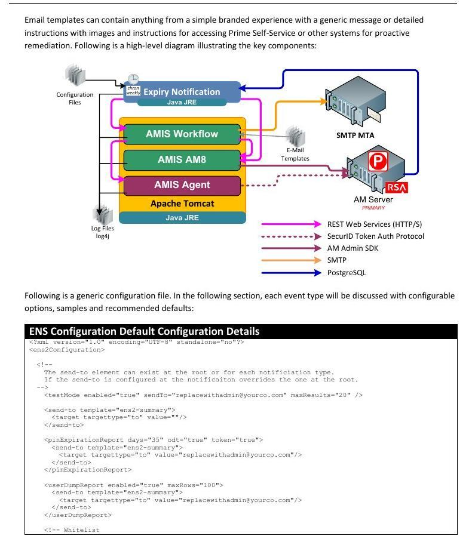

# 61. The Complete ENS2 Event Reference (Imported from the Official Guide)

Nineteen of the guide's eighty pages document ENS2 — by far the most complete treatment in existence, superseding both the one-paragraph training mention (Section 3.3) and the deck procedure (Section 47.3). This chapter imports it as working reference. ENS2 is a command-line Java executable run on a schedule to automate end-user and administrator notifications for token lifecycle events, and — where configured — to **take action** on tokens and accounts that exceed inactivity limits.

## 61.1 Event Catalog and Architecture

Supported events (the guide bolds the most commonly used, marked ● here): **● token PIN expiration**, ODT PIN expiration, ODT token expiration, **● token expiration**, **● token inactivity alerting with optional shutdown**, ODT inactivity with optional shutdown, **● account inactivity alerting with optional shutdown**, and account expiration alerting. Notifications ride the AMIS workflow HTML template framework; each run also emails a per-event **summary report with a CSV attachment** to an administrative alias. One network prerequisite stated only here: **SSL/TLS PostgreSQL, TCP 7050, must be open from the AMIS server running ENS to the AM Primary** — ENS reads the AM database directly through a purpose-created read-only account. ENS can technically run remotely from AMIS, but the guide recommends co-locating it on an AMIS node for performance and configuration ease.

***Figure V-4 — ENS2 Component Architecture: Expiry Notification atop AMIS Workflow/AM8/Agent, with SMTP, PostgreSQL, and template paths (Install Guide v2.0, p.54)***

## 61.2 Installation Essentials (Confirming and Completing Section 47.3)

The guide's 32-step procedure matches Part III slides 87–89 and adds the missing precision: the read-only DB account default is **ensreadonly** and *must match the userID in ens2-grants.sql if changed*; the rsautil create command takes an explicit netmask parameter (\-n 255.255.255.255) alongside the AMIS IP; success is verified by **cat'ing the ens-grants-out CSV and seeing GRANT rows**; the amisdebugvar for the ENS properties is a fresh UUID (uuidgenerator.net — the same pattern as Part IV slide 30); the completed Template Builder file is **saved with a password**; the log directory is set to /opt/rsa/primekit/logs/ens2; execution is ../java/latest/bin/java \-jar Main.jar \-W 7 from the ens2 directory; and production operation is a **crontab entry with test mode disabled only after validation**. The file inventory: ens2-config.xml (events, intervals, template references), ens2.properties (connectivity — encryptable via Template Builder), logconfig.xml (log4j, with optional syslog appenders), Main.jar; plus, in config/: ens2-configuration.apt, ens2-grants.sql, grants.sh. **Template placement rule:** the bundled mail templates ship in the standard AMIS package, and any new or customized template must be copied to /opt/rsa/primekit/configs/amis/workflow/mail/templates/email — tying ENS directly into Section 35's template system.

## 61.3 The Window Semantics (-W)

The concept everything else depends on: ENS fires an interval when the target date falls within **\[interval, interval \+ window\]** of the run date. With the typical \-W 7 (weekly runs), a 90-day PIN-expiration interval fires for every PIN expiring **90–96 days** out. Each interval in an event is processed independently, and the run closes with the administrator CSV report. Corollaries: the window must be ≥ the run cadence or events fall through the gaps, and the **openEnded="true"** attribute exists to catch anything *beyond* the largest interval (e.g., a token inactive 200 days during an ENS outage) — the guide calls this out explicitly as protection against extended outages.

## 61.4 Global Elements: testMode, send-to, whitelist

* **testMode — the safety interlock.** \<testMode enabled="true" sendTo="…" maxResults="20"/\> redirects all mail to a test address and hard-stops the run at maxResults events. Two rules from the guide: keep it enabled until every chosen event has been validated ('should always be configured and enabled before a go live'), and because maxResults counts the *entire run* — not per event — **test one event type at a time** or the throttle will mask untested events.

* **send-to — the admin report target.** Global element naming the report template (default ens2-summary) and the administrative alias; per-event send-to blocks override the root. Guide recommendation: reports go to an alias, with ownership held by a small team of senior admins and business managers.

* **whitelist — the exclusion mechanism.** Comma-delimited entries of three types — bare user: IDs (the default type), security\_domain:\<name\>, and identity\_source:\<name\> — applicable globally and per event; the global list **merges** with event lists at run time (duplicates tolerated). Field use: whitelist the bind and service accounts (the guide's own passwordExpiration sample whitelists sspbind and the service\_accounts domain) so automation never disables the plumbing.

## 61.5 Per-Event Reference

| Event | Purpose / Targets | Key Attributes & Actions | Field Notes (per the guide) |
| :---- | :---- | :---- | :---- |
| tokenExpiration | End-user warnings that a token expires in N days; template should link to SSP for replacement | enabled; notification intervals (e.g., 90/60/30/15) each with days, description, template | Each interval may have its own template or share one; admin report uses global send-to |
| tokenPINExpiration | PIN-expiry warnings for hardware/software tokens (compares last PIN change date) | days \= PIN age at expiry; per-interval template | Notify even without self-service PIN change so the forced change isn't a surprise |
| odtPINExpiration | PIN-expiry warnings for OnDemand tokens | As above, ODT last-PIN-change basis | Same rationale as tokenPINExpiration |
| pinExpirationReport | Admin-only global PIN expiration report | days; odt true/false; token true/false | Legacy feature retained for compatibility — superseded by the two end-user PIN events |
| userDumpReport | Admin report dumping users (maxRows) | enabled; maxRows | Should be disabled by default; honors whitelisting |
| inactiveODT | ODT inactivity warnings \+ optional automatic disable | notification days; openEnded; action="disable" (only action) | Report-only first; enable action only after admins and business managers accept the results |
| inactiveTokens | HW/SW token inactivity \+ optional action | actions: "disable" or "unassign" — token-scoped, never the account; openEnded | Common cause: lost token replaced by assignment (not replacement) leaves the old token attached and unused — a security concern this event cleans up |
| inactiveUsers / inactiveAccount | Account inactivity \+ optional action (internal DB and registered external users) | actions: "disable" (both) or "delete" (internal DB only); openEnded | Auth updates last-login stamps; RBA/fixed-passcode externals rely on the account last-login. Start with disable only — a misconfiguration must never delete accounts. Also frees license count from zombie registrations |
| passwordExpiration | Password-expiry warnings — internal DB users only (RBA/self-service/console credentials) | notification days; whitelist | External users ignored even if registered; whitelist service/bind accounts |
| userAccountExpiration | Warnings before internal-DB account expiration dates hit | notification days | No action attribute — AM disables expired accounts itself; this exists to prompt extensions (contractors) |

## 61.6 Testing and Execution Recommendations (Verbatim Policy)

The guide's operating policy, adoptable as-is in engagement handoffs: test each desired event **one at a time** under testMode with a sane maxResults; only after every chosen interval is validated should production rollout be considered; run frequency **no less than every 7 days and no more than every 30 — a weekly rhythm is most appropriate**; schedule via crontab (or equivalent service automation); configure logging through logconfig.xml's standard log4j facilities, optionally with syslog appenders (the SIEM path of Part IV slide 24); and send administrative reports to an alias while keeping solution ownership with a small senior team. This chapter plus Section 47.3 now constitutes complete ENS coverage — from database grants to event tuning.
